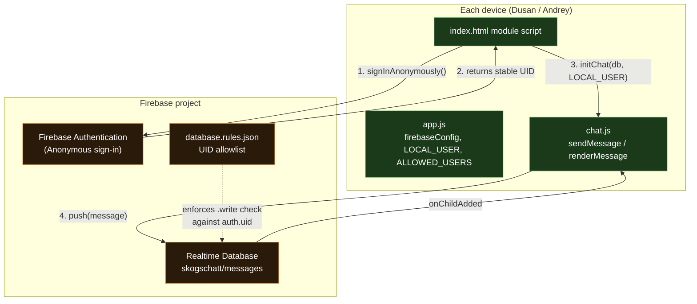

# Anonymous Auth + Device Allowlist for Firebase Writes

## Context

Currently `chat.js` writes to `skogschatt/messages` with no Firebase
authentication at all — anyone with the (eventually-real) `firebaseConfig`
could read/write. The client-side `LOCAL_USER` constant in `app.js` is purely
cosmetic (decides "Dusan" vs "Andrey" labeling/bubble side) and provides zero
real protection — it's not a security boundary.

To make "only Dusan & Andrey can post" an actual enforced rule (not just a
client-side label), we need:

1. **Firebase Anonymous Authentication** — each device signs in anonymously
   on load, getting a stable per-device UID (persisted by the SDK across
   reloads).
2. **A UID allowlist in Realtime Database security rules** — only the two
   known UIDs (Dusan's device, Andrey's device) may write to
   `skogschatt/messages`. Everyone else (read-only or fully blocked,
   depending on preference) is rejected by the backend itself.

This plan produced:
- The code changes in this repo (auth wiring in `app.js`/`index.html` module
  script).
- A `database.rules.json` file with the allowlist structure, ready to paste
  into the Firebase console's Realtime Database Rules tab once the project
  exists.
- A short manual setup checklist (console steps) for the user, since those
  can't be done from this repo.

## Logical architecture



Key point: the **enforcement boundary is `Rules`**, not anything in the repo.
Code in this repo (`app.js`'s `ALLOWED_USERS`) is just a client-side label
guard — convenient for catching typos, irrelevant to actual security.

## Manual setup steps (Firebase Console — not done yet)

1. Create a Firebase project and register a Web App; copy the generated
   `firebaseConfig` into `src/app.js`, replacing the `YOUR_*` placeholders.
2. Enable **Realtime Database** (Build → Realtime Database → Create Database).
3. Enable **Authentication → Sign-in method → Anonymous**.
4. Run the app once per device (Dusan's machine, Andrey's machine). Each will
   get a UID assigned by `signInAnonymously`. Temporarily log
   `auth.currentUser.uid` to the console (or display it in the UI) to capture
   both UIDs.
5. Paste the two UIDs into `database.rules.json` (replacing the
   `"REPLACE_WITH_DUSAN_UID"` / `"REPLACE_WITH_ANDREY_UID"` placeholders) and
   publish the rules in the console's **Realtime Database → Rules** tab.
6. Remove/comment out the temporary UID-logging step once both UIDs are
   captured.

## Deployment — how this fits with GitHub Pages

This project deploys by **pushing `master`**, which GitHub Pages serves as
static files (per CLAUDE.md). That deployment path is unaffected by this
change — `app.js`, `index.html`, `chat.js`, and `service-worker.js` are still
plain static files served the same way.

However, **`database.rules.json` does NOT deploy via GitHub Pages.** Realtime
Database rules live on Firebase's servers, not in the static site bundle.
Publishing them requires either:
- Manually pasting the JSON into the Firebase Console's Rules tab (fits the
  no-build-step convention — this is the chosen approach), or
- (Not in scope) using the Firebase CLI (`firebase deploy --only database`),
  which would introduce a build/deploy tool this project currently doesn't
  have.

So: **code changes ship via the normal `git push` to `master` → GitHub Pages
flow as always; the rules file ships separately via a one-time manual paste
into the Firebase console.** The rules take effect immediately upon publishing
in the console, independent of any GitHub Pages deploy.

## Code changes (completed)

### 1. `database.rules.json` (new file, repo root)

```json
{
  "rules": {
    "skogschatt": {
      "messages": {
        ".read": "auth != null",
        ".write": "auth != null && (auth.uid === 'REPLACE_WITH_DUSAN_UID' || auth.uid === 'REPLACE_WITH_ANDREY_UID')",
        "$messageId": {
          ".validate": "newData.hasChildren(['user', 'text', 'ts'])"
        }
      }
    }
  }
}
```

Source of truth to paste into the Firebase console once UIDs are known; also
documents the security model in-repo.

### 2. `src/app.js`

- Added `export const ALLOWED_USERS = ["Dusan", "Andrey"];` — a client-side
  guardrail validated against `LOCAL_USER` at startup; alerts/throws on typo.
  This is a sanity check, NOT the security boundary — that's
  `database.rules.json` + Firebase Auth.
- Fixed comment typo "Andrejs" → "Andrey".
- No `.env` — not feasible for this static, no-build PWA.

### 3. `src/index.html` (module script)

- Imports `getAuth`, `signInAnonymously` from `firebase-auth.js` (CDN
  10.12.0).
- After `initializeApp`, calls `getAuth(app)` and `signInAnonymously(auth)`.
- Waits for sign-in to resolve before calling `initChat(db, LOCAL_USER)` —
  writes would otherwise be rejected by rules until `auth != null`.
- Validates `LOCAL_USER` against `ALLOWED_USERS` and fails loudly (alert +
  halt init) if invalid.

### 4. `src/chat.js`

- `initChat(db, user)` signature unchanged — `user` remains the
  "Dusan"/"Andrey" display label for rendering. UID only matters to the
  security *rules*; the Firebase SDK attaches auth context to writes
  automatically.
- Added a comment noting writes are gated by Firebase Auth + RTDB rules (see
  `database.rules.json`), so `_user` remains a display label only.

### 5. `service-worker.js`

- Bumped `CACHE` to `skogschatt-v14` (per CLAUDE.md convention) since
  `index.html` and `app.js` changed.

## Verification

- No real Firebase project exists yet, so end-to-end auth/rules enforcement
  hasn't been tested live.
- Verified: all changed files reviewed for syntax correctness; `app.js`,
  `chat.js`, `ui.js`, `index.html` consistent with ES module conventions.
- Remaining: complete the manual Firebase Console steps above, fill in real
  UIDs in `database.rules.json`, and publish rules.
